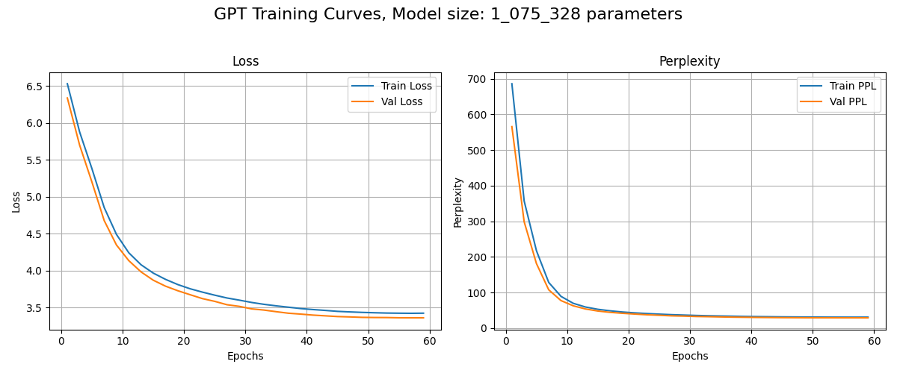

# Language Models from "scratch"
language modeling with ngram up to simple GPT model (decoder only transformer) as described in the [Attention is all you need](https://arxiv.org/abs/1706.03762) paper. <br>

In [notebooks/](./notebooks/) you can find a guided runthrough of training and using the models, as well as analyses of the hyperparameter search. <br>

Tokenizer: <br>
- byte level bpe tokenizer [ [wraper of hf Tokenizer](./bpe_hf.py) ] <br>
  
Models implemented:
- [Ngram model](./ngram_engine) <br>
- [Neural bigram model](./neural_bigram.py) <br>
- [GPT model (decoder only)](./GPT_mj.py) <br>

Data set: [shakespeare](./data/) <br>
- to download and preprocess the data run [clean_nltk_shakespear_data_w_nl.py](./data/clean_nltk_shakespear_data_w_nl.py) from the root (repo) directory: <br> 
  ```python clean_nltk_shakespear_data_w_nl.py``` <br>

# Results

TODO:
 - add the results and briefly describe them. 
... 

tiny GPT training curves: <br>
 <br>


